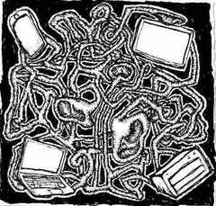

# Live Streaming Platform As An Instrument, Experience And Pastime

This is an archive of code and media related to a long-term creative project
that spanned
[the early years of my software development career](https://louisfoster.com/live-streaming-platform).

[Project Archive](https://codeberg.org/bytetrie/live-streaming-platform)

[Project Archive Website](https://bytetrie.codeberg.page/live-streaming-platform/)

[Project Paper](https://bytetrie.codeberg.page/live-streaming-platform/#paper)

## Harshroom (circa 2016)

Harshroom was a prototype to visualize the concept of having a labyrith of rooms
containing spatialized audio streams. I used THREE.js for the 3D part and React
for the UI. Although the core idea was to not have a visual aspect, it served as
a way to communicate and imagine what it could be.

- It will only build using Node 12.
- Rollup for the build tool, which I believe was the preferred alternative to
  Grunt.
- It appears I hand-inserted a live-reload script tag for development.
- Three.js for the 3D rendering. I didn't really understand how to make a
  visuanl mesh and floor mesh for this, so I used ThreeBSP, which iirc resulted
  in fairly bad performance.
- React 15 for the minimal UI stuff, definitely overkill.
- Scss for building styles, which required a binary in order to compile.
- I was mimicing the code style of Three.js, so lot's of white space.
- My notes say that I was planning to expand this to include many rooms with
  stairs and hallways to join them. I eventually started to explore this
  separately when learning building game engines and levels.
- This project was where I first learned about virtually spatialized audio.

[Harshoom code](https://codeberg.org/bytetrie/live-streaming-platform/src/branch/main/code/harshroom)

[Harshroom live demo](https://bytetrie.codeberg.page/live-streaming-platform/demo/harshroom)

## Noisecollab (circa 2017)

Noisecollab was a little experiment attempting to explore the "collaborative
audio" part of the concept. The idea was that participants would record a second
of audio, which would then upload to the server. The audio snippet would be
inserted into a 10 second audio loop. The updated loop will then prompt all
participants to reload their loop, and subsequently all future requests would
pull the newest loop.

- I was now using Gulp, it seems in addition to Rollup.
- It was primarily built around [SoX](http://sox.sourceforge.net/), "the Swiss
  Army knife of sound processing utilities".
- I had written out [a system design document](./code/noisecollab/MVP.md) to
  help guide my implementation.
- It appears I had tried a very simple (aka naive) approach to ensuring the
  integrity of the data. But I end up not using it any way, nor adding any login
  system.
- I needed to implement a way to ensure audio seamlessness by splitting
  recordings over the beginning and end of the loop.
- I used a request to random.org to get random values instead of generating them
  on the server.
- I was making notes to myself in the code as I was thinking through problems,
  such as handling asynchronous data.

[noisecollab code](https://codeberg.org/bytetrie/live-streaming-platform/src/branch/main/code/noisecollab)

[noisecollab demo video](https://bytetrie.codeberg.page/live-streaming-platform/#noisecollab-video)

## Drawcollab (circa 2018)

With Drawcollab, I shifted gears back to graphics and tried building a
collaborative drawing experiment. It was mostly to learn Go for server-side
code, Redis to manage data, and C++ for OpenGL-based rendering.

- This was one of my first WebSockets projects.
- I was pretty new to memory management, so the program would often crash.
- The choices I made regarding the languages was mostly about performance. I was
  getting tired of the limitations of the browser and node.js and wanted to see
  how different the experience would be using Go, C++, WebSockets, and Redis.
- I recall really enjoying using Go. C++ on the otherhand was still beyond my
  ability at the time, I struggled with debugging and code structure.
- I also recall having my mind blown by how fast it worked and how easily it
  handled all the participants using it.
  - One participant figured out how to abuse the API and very quickly filled the
    entire collaborative canvas. It was entertaining to watch as the room saw
    everything we did evaporate under a single color - I wish I had recorded it!
    It helped me grasp how easy and quickly it can be for people that want to
    "break" a thing, as soon as there's even a slight incentive to do so.
    - For reference, the exploit was just the lack of throttling. The message
      system took every request. It also made me realise there was a memory bug
      somewhere, I think in the C++ code, because at some point while handling
      the updates the program crashed.
- I was again making design notes and figuring out how to expand the project.

[drawcollab code](https://codeberg.org/bytetrie/live-streaming-platform/src/branch/main/code/drawcollab)

## Raspberry Pi and Icecast (circa 2019)

Towards the end of 2019, I began to focus back towards audio and the realisation
of the original vision. It started with learning about synthesizers, both
physical and virtual, and building a self-hosted personal radio stream from my
library. I had visited
[Geoff Stern Art Space](https://www.geoffsternartspace.com/about/) and was
exposed to the idea of using multi-channel audio for sound art. The synthesis
was to imagine taking a collection of many streaming URLs, and feeding each one
into a speaker. The speakers would immerse the participant in sound and they
could move through the soundscape via streams moving into and throughout the
channels.

I think this would work by using a cheap SBC like a Raspberry Pi Zero and
connecting it to only one or two channels, and coordinating every SBC used
through a local network. This project stalled because of the complexity of
trying to use a single machine, as well as handling both input and output, and
the requirement of so much hardware and technical setup. I abandoned this
approach for something easier for participants to access and use.

- Attempted use of python and pyo to handle audio.
- I was actively calculating prices to set up the system.
- I recall encountering limits with doing concurrency / async code in Python in
  a way that I was familiar with in JavaScript.
- Built many install / setup scripts with rudimentary exception handling.
- Encountered xrun issues due to buffer size, I think that was new to me.
- Iterations of development were split across completely new "versions" of the
  system. Usually appropriating chunks from the prior version, splitting stuff
  up, and throwing parts away that didn't work the way I'd hoped.

[raspberry pi and icecast code](https://codeberg.org/bytetrie/live-streaming-platform/src/branch/main/code/rpi_icecast)

## _noisecrypt (circa 2020)

After I realised Raspberry Pi + multiple audio interfaces + Icecast + Python +
bash wasn't going to work as a teachable system, I moved on to trying to build
this as a web app. The experience with that other system was informative and
provided me with a reference, but in comparison it felt much harder to achieve
the design I had converged on.

At this stage I had departed entirely from the "surrounded by speakers on
streaming audio" model and was building a glitchy performance tool. In
retrospect, I think I should've spent more time trying to really figure out the
validity of the design as something other people would enjoy using. However, I
was invited to present my project at workshops and get grants, so it resonated
with other people to that extent. However, it was difficult to articulate the
coherency between the original concept and what I was now building.

Working in the browser and centralizing the streams came with its own
complexity. What my code examples here don't reveal was how hard it was to
figure out how to get audio to segment then seamlessly join. Decompressed audio
doesn't look like a perfect representation of a pre-compressed chunk of audio.
Each type of compression results in a different looking artefact as well. The
wave is shaped different, if you treat each segment as an isolated unit you will
have compression artifacts, there might be padding, and all of it has to be
blended in with the rest of the audio to make it not pop. Beyond the audio you
have to handle the load on the server, storage, browser API support, and
performance.

- Unique naming approach for the different component projects.
- The use of running everything with it's own mini web app.
- Use of Typescript for FE and BE (Deno).
- Using a tool to help with testing recording audio input.
- Makefiles to help manage build, run, and test scripts.
- nginx and JS config templating.
- sqlite / relational data to store stream and segment data.
- Material UI and UI helpers for using the system.
- Intended to be public - setup notes included.
- Used for presenting at workshops.
- Hash IDs for content addressing.
- systemd service units for automating start up.
- The use of a service to provide random selection to audio stream selection.
- WASM for the encoding of audio segments, mostly
  [opus-stream-decoder](https://github.com/AnthumChris/opus-stream-decoder).

[_noisecrypt code](https://codeberg.org/bytetrie/live-streaming-platform/src/branch/main/code/noisecrypt)

[_noisecrypt demo video](https://bytetrie.codeberg.page/live-streaming-platform/#noisecrypt-video)

This is meant to be an image of a desktop computer, a laptop, a phone, a server,
and human ears, all tangled together through a spaghetti-like network.

## Rivalium (circa 2021)

After the first couple of workshops I ran with _noisecrypt, I wanted to make
some improvements of the system. The UI wasn't quite where I wanted it to be in
terms of how usable it was, there was a lot of copy and paste, separate web apps
for each part, and it wasn't clear how to use it altogether. I wanted to be able
to improve some of the client-side parts separately to the web app, so I moved
them into separate modules. I changed the same to try to indicate the type of
system it had become as "noisecrypt" I felt was invoking a different mental
image of the system to what it was.

One experiment that I couldn't get working was the use of
[Audioworklets](https://developer.mozilla.org/en-US/docs/Web/API/AudioWorklet).
They were fairly new to browsers (added April 2021), and they were meant to
replace the deprecated ScriptProcessorNode. I was new to how to optimize for
them, so I couldn't figure out how to manage the very small buffer they handled.
I was doing too much work in them, which would cause overruns, and therefore
pops in the audio stream. I eventually abandoned them and returned to the
deprecated API.

I also spent a lot of effort building out a completely custom UI system and the
framework (on top of redom) to go with it. I probably should've avoided that,
but I was really interested in how to think through the problems and find
solutions (preferably, simpler) to those the mainstream frameworks solved.

- CLI helper for running service.
- Custom URL ID alphabet and length.
- Completely new UI.
- Create a UI component library.
- UI contained it's own embedded "help" system.
- Now using Snowpack build tool.
- class / OO based UI code for the client-side app.
- Basically an entirely custom UI framework (built on top of redom).
- Developing client-side recording / playback systems as separate libraries that
  are then imported as npm dependencies.
  - Both have example server / UI to test the modules.
  - I provided example data for the examples.
- JSS for styling.
- I think I developed some strange coding habits on this project, such as the
  dependence on method chaining.

[Rivalium example audio (dawn chorus)](https://bytetrie.codeberg.page/live-streaming-platform/#dawn-chorus)

[Rivalium user demo video](https://bytetrie.codeberg.page/live-streaming-platform/#rivalium-video)

[Rivalium UI component system demo](https://bytetrie.codeberg.page/live-streaming-platform/demo/rivalium_ui)

My performance gear used as part of an arts grant I received for this project.

## Post-Rivalium

After the performance grant and conference paper, I felt like I had learned what
I intended to and more. The project itself diverged so far from the original
vision as to no longer be recognisable. It went from conceptually a live audio
virtual world to a glitchy aleatoric networked feedback web music performance
platform.

It was fun to use and incredibly valuable for my learning experience. The reason
for the divergence was the practicality and feasibility of building out the
vision and my pursuit of the different tangents generated along the way. In the
end I had other projects take priority and wanted to learn something new.
